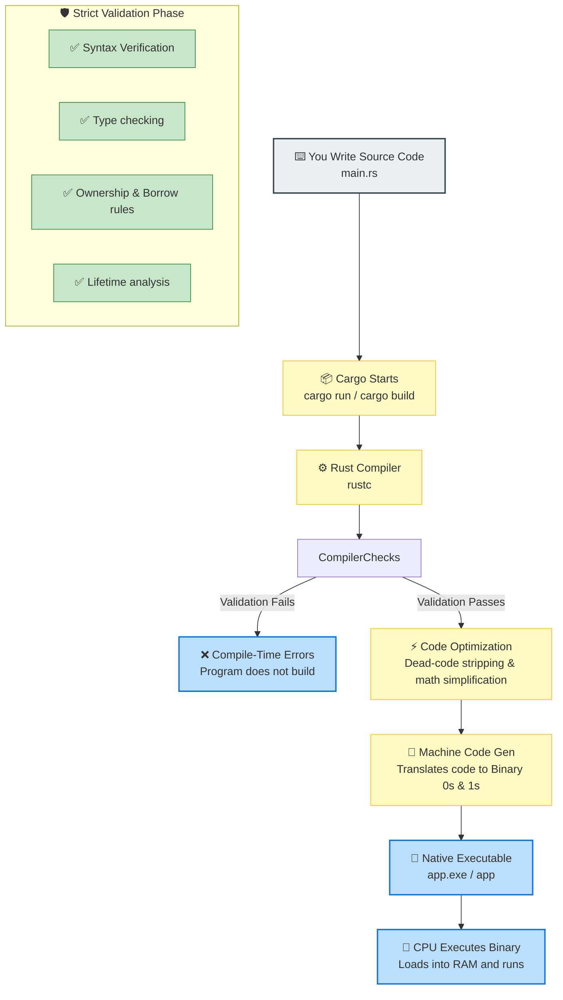

# Rust Day 3: How Rust Works Internally 🦀

Welcome back! Yesterday, we learned about variables, shadowing, control flow, loops, and basic data types. Today, we're going to dive under the hood and answer a critical question that most beginners overlook:

> **"What actually happens after I write Rust code and execute it?"**

Understanding how Rust works internally will help you demystify compiler errors and write more efficient systems software.

---

## 🗺️ The Journey of a Rust Program

Suppose you write this simple program:

```rust
fn main() {
    println!("Hello, World!");
}
```

While it looks simple, your CPU does not understand Rust. Your computer only understands **Machine Code (0s and 1s)**. Here is the step-by-step process of how Rust code travels from your keyboard to the processor:

### 🔄 The Compilation Pipeline



---

## 🛠️ Step-by-Step Breakdown

### Step 1: You Write Source Code
You write code in text files ending with `.rs` (like `main.rs`). This is called **Source Code** because it is human-readable, written by the programmer.

### Step 2: Cargo Starts the Build Process
When you run a build command in your terminal:
```powershell
cargo run
```
Cargo acts as your **project manager**. 
> [!IMPORTANT]
> **Cargo is NOT the compiler.** 
> Cargo is a package manager and build orchestrator. It manages directories, fetches libraries, and then calls **`rustc`** (the actual compiler) to compile the code.
> 
> ```text
> [You] ──(run command)──> [Cargo] ──(invokes compiler)──> [rustc]
> ```

### Step 3: The Compiler (`rustc`) Checks Your Code
`rustc` acts like a strict teacher checking an exam. It verifies:
* **Syntax**: Are there missing semicolons or brackets?
* **Data Types**: Are you doing invalid operations? For example:
  ```rust
  let age = "Twenty";
  let result = age + 5; // ❌ Compile-Time Error: String + Integer is invalid
  ```
If any checks fail, the compiler issues a **Compile-Time Error** and immediately stops the build. **The program never executes, meaning you cannot run broken code.**

### Step 4: Optimization
If all checks pass, `rustc` simplifies your code. For instance:
```rust
let x = 5;
let y = x + 0;
```
The compiler realizes that adding zero changes nothing, so it optimizes it down to:
```rust
let y = 5;
```
This is called **Optimization**. It makes your program run faster and consume less memory, with zero manual overhead.

### Step 5: Machine Code Generation
`rustc` translates your clean, checked code into binary instructions:
```text
1010110101001011...
```
This is called **Machine Code**.

### Step 6: Native Executable
Rust packages the machine code into a standalone binary file:
* **Windows**: `app.exe`
* **macOS / Linux**: `app`
When you execute this file, your computer’s **CPU (Central Processing Unit)** reads these raw instructions directly from RAM and executes them.

---

## 🏎️ Why Rust is Blazing Fast: The Two Chefs Analogy

Imagine two different restaurant kitchens:

```mermaid
graph LR
    subgraph Compiled Languages (Rust, C, C++)
        c_code[📝 Order / Code] --> c_prep[👨‍🍳 Chef Pre-cooks & Prepares Everything]
        c_prep --> c_serve[🚀 Instant Service to Customer]
    end

    subgraph Interpreted Languages (Python, JS)
        i_code[📝 Order / Code] --> i_cook[👨‍🍳 Chef cooks line-by-line while customer eats]
        i_cook --> i_wait[⚠️ Customer waits between bites]
    end
```

* **Chef A (Interpreted - Python / JavaScript)**: Reads the recipe (source code) line-by-line *while* cooking and serving the customer. Because the interpreter must read and translate code during execution, it runs slower.
* **Chef B (Compiled - Rust / C / C++)**: Pre-cooks and packages everything before the customer even sits down. Once requested, the food (machine code executable) is served instantly. 

---

## 📊 Compiled vs. Interpreted Languages

| Feature | Compiled Languages (Rust, C, C++) | Interpreted Languages (Python, JavaScript) |
| :--- | :--- | :--- |
| **Execution Tool** | **Compiler** translates code before running. | **Interpreter** reads and executes code line-by-line. |
| **Performance** | Extremely Fast (native machine speed). | Slower (runtime translation overhead). |
| **Bugs Caught** | At compile-time (before the program runs). | At runtime (while the user is using the program). |
| **Distribution** | Standalone executable (no runtime needed). | Requires interpreter installed on user's machine. |

---

## 🛡️ The Structural Analogy: Building a Safe Bridge

Why is the Rust compiler so strict?

Suppose a bridge engineer finds a tiny structural crack during planning:
* **Option A (Interpreted/Unsafe approach)**: Open the bridge to traffic immediately and hope nothing goes wrong. Fix it when it collapses.
* **Option B (Rust approach)**: Refuse to open the bridge until the crack is fixed.

Rust always chooses **Option B**. It forces you to fix bugs at **compile-time** rather than debugging crashes in production when your code is already running.

---

## ⚡ Rust Build Modes

When developing, Cargo allows you to compile in two modes:

1. **Debug Build** (`cargo build` / `cargo run`)
   * Compiles code quickly.
   * Includes debug symbols (makes it easy to find errors using tools like LLDB).
   * No heavy code optimizations.
   * *Ideal for active development.*
2. **Release Build** (`cargo build --release` / `cargo run --release`)
   * Takes longer to compile.
   * Applies full compiler optimizations.
   * Strips debug symbols (smaller file size, faster execution).
   * *Ideal for production deployment.*

---

## 📚 Homework: Test Your Knowledge

### 📝 Part 1: Theory Questions
Write your answers down to test your understanding:
1. What is **source code**?
2. What is **machine code**?
3. What is the process of **compilation**?
4. What is the difference between **Cargo** and **`rustc`**?
5. Why does Rust catch errors *before* running the program?
6. What are the differences between **Debug** and **Release** build modes?

---

### 💻 Part 2: Practical Exercises
Open your terminal inside your `rust_learning` workspace and run the following checks:

1. **Verify your Rust version**:
   ```powershell
   rustc --version
   cargo --version
   ```
2. **Navigate into the Day 3 directory**:
   ```powershell
   cd rust_learning_day3
   ```
3. **Check the code without compiling**:
   ```powershell
   cargo check
   ```
4. **Compile and execute a Debug Build**:
   ```powershell
   cargo run
   ```
   *Observe the output printed on the console.*
5. **Compile a Release Build**:
   ```powershell
   cargo build --release
   ```
   *Check the newly created folder at `target/release/`. You will find the highly optimized `rust_learning_day3.exe` executable inside!*
