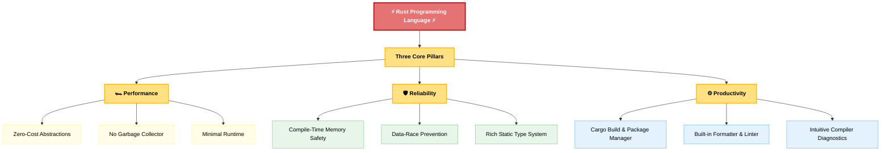
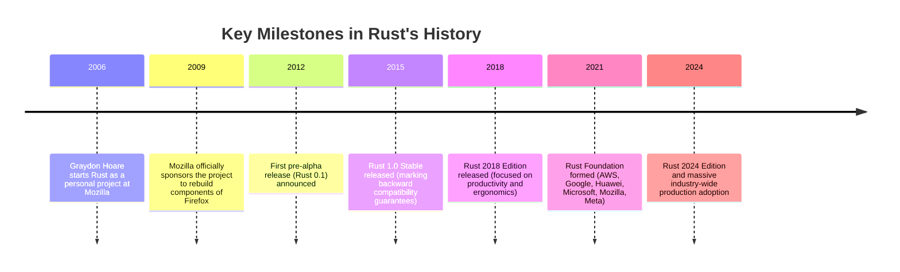
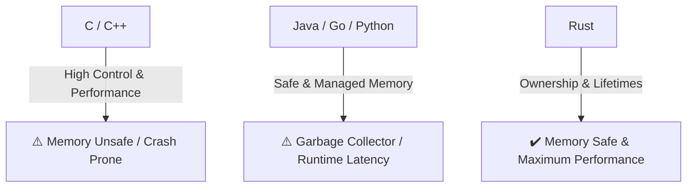
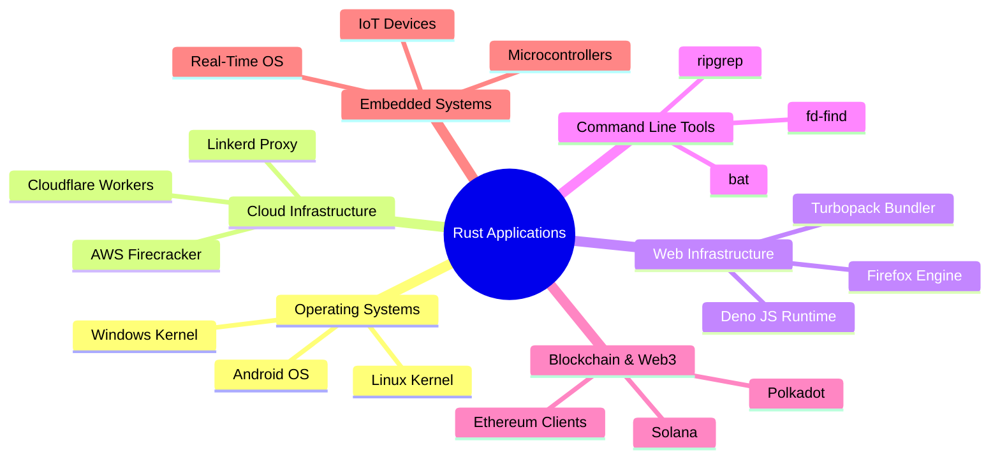
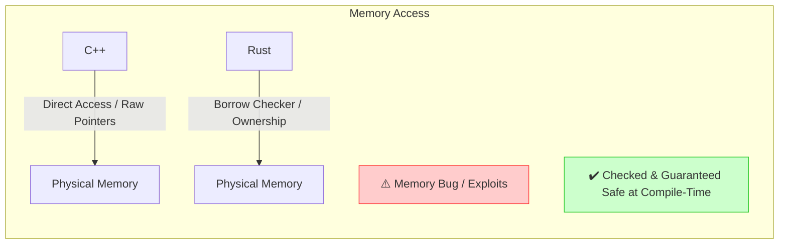
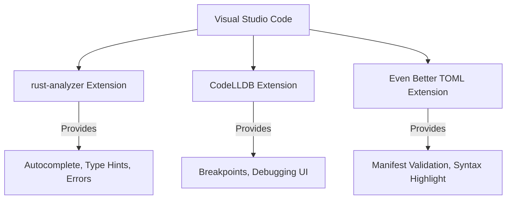
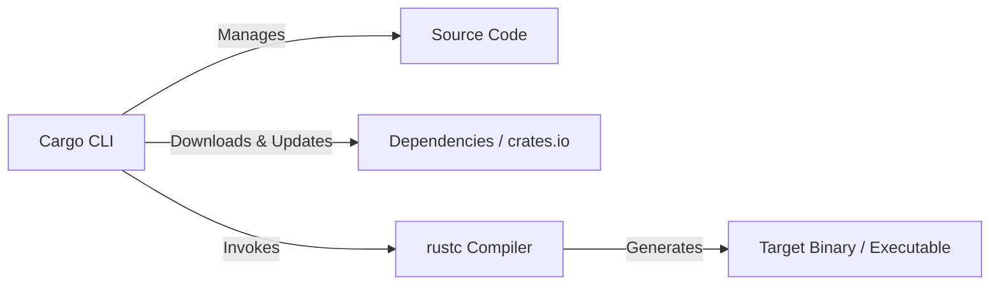
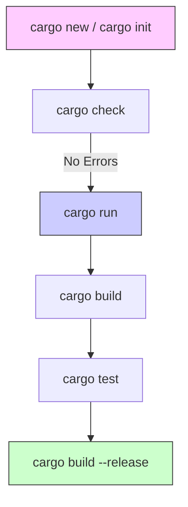

# Module 1: Introduction to Rust

Welcome to **Module 1: Introduction to Rust**. This comprehensive guide is designed to take you from a complete beginner to understanding the core philosophy, history, setup, and tooling of the Rust programming language. 

By the end of this module, you will have a working Rust development environment on Windows, understand how Cargo manages projects, write and run your first program, and be ready to dive into the language syntax.

---

## 1. What is Rust?

**Rust** is a multi-paradigm, high-performance, statically typed systems programming language designed for **safety, speed, and concurrency**. It compiles directly to native machine code (like C and C++), meaning it has no virtual machine and no interpreter.

Rust achieves memory safety without a garbage collector by enforcing a strict set of rules checked at compile-time called the **Ownership Model**.



### Interactive Deep Dive: Explore the Three Pillars

*Click on each pillar below to explore what makes it special, see quick code comparisons, and test your knowledge!*

<details>
<summary>🏎️ Pillar 1: Performance (Zero-Cost Abstractions & No GC)</summary>

#### Why does it matter?
Most high-level languages rely on a **Garbage Collector (GC)** that periodically runs in the background to search for and delete unused variables. This causes sudden pauses in execution (latency spikes). Other languages require a heavy **Runtime Environment** (like the Java Virtual Machine).
Rust compiles directly to native machine code with **no Garbage Collector** and **no runtime environment**.

#### What does "Zero-Cost Abstractions" mean?
It means: *What you don't use, you don't pay for. And further, the abstractions you do use compile down to code that is as efficient as if you had written it by hand in assembly or raw C.*

#### Quick Comparison: Rust vs Managed Languages
```mermaid
graph TD
    subgraph Python/Java (GC Run)
        code1[Your Code] --> vm[Runtime VM / Interpreter]
        vm --> gc[Garbage Collector: Checks Heap periodically]
        gc --> pause[⚠️ Unexpected Pause / Latency]
    end

    subgraph Rust (Direct)
        code2[Your Code] --> compiler[Compile-Time Borrow Checker]
        compiler --> binary[Highly Optimized Native Binary]
        binary --> direct[✔️ Executes directly at hardware speed]
    end
```

> [!TIP]
> **Performance Quiz**: If Rust has no garbage collector, how does it know when to free memory?
> <details>
> <summary>Click to reveal the answer</summary>
> 
> Through **Ownership Rules**! The compiler inserts code to automatically free memory the exact moment a variable goes out of scope. It does this at *compile-time*, so there is zero runtime overhead!
> </details>

</details>

<details>
<summary>🛡️ Pillar 2: Reliability (Compile-Time Safety & Thread-Safety)</summary>

#### Why does it matter?
In systems languages like C or C++, memory management is manual. If you free a variable's memory but accidentally try to use it again, you get a **Use-After-Free** bug, which can be exploited by hackers or crash your system.
In Rust, the compiler's **Borrow Checker** validates your references at compile time. If your code could potentially leak memory, dereference a null pointer, or cause a data race between multiple CPU threads, **it will fail to compile**.

#### Quick Concept: The Borrow Checker in Action
Imagine a library book:
* Only one person can own the book (Ownership).
* Multiple people can read the book at the same time (Immutable borrows).
* Only one person can write notes in the book at a time, and no one else can read it while they write (Mutable borrow).

Rust enforces these rules at compile time:
```rust
fn main() {
    let mut book = String::from("The Rust Book");

    let reader1 = &book; // Borrowed immutably
    let reader2 = &book; // Borrowed immutably (OK!)
    
    // let writer = &mut book; // ❌ ERROR: Cannot borrow as mutable because it's already borrowed as immutable!
    
    println!("Readers: {} and {}", reader1, reader2);
}
```

> [!TIP]
> **Reliability Challenge**: Why does Rust block you from writing to a variable while other threads are reading it?
> <details>
> <summary>Click to reveal the answer</summary>
> 
> To prevent **Data Races**. If one thread modifies a value while another thread is reading it, the reading thread might get corrupted, partial, or out-of-date data. By enforcing exclusive access for writes, Rust guarantees thread safety!
> </details>

</details>

<details>
<summary>⚙️ Pillar 3: Productivity (Cargo, Clippy, and Compiler Help)</summary>

#### Why does it matter?
Many developers are intimidated by systems programming because the build tools are complex and error messages are cryptic. Rust turns this around by giving you:
1. **Cargo**: A single command (`cargo build`, `cargo run`, `cargo test`) to do everything.
2. **Clippy**: A built-in tutor that scans your code and suggests improvements.
3. **Friendly Compiler**: Rust's errors don't just say `Syntax Error`. They show you exactly where the problem is, explain *why* it's a problem, and often provide a `Help` hint with the exact code change needed to fix it!

#### Example of a Compiler error in Rust:
```text
error[E0382]: borrow of moved value: `s`
 --> src/main.rs:5:22
  |
2 |     let s = String::from("hello");
  |         - move occurs because `s` has type `String`, which does not implement the `Copy` trait
3 |     let s2 = s;
  |              - value moved here
4 |     
5 |     println!("{}, world!", s);
  |                            ^ value borrowed here after move
  |
help: consider cloning the value if the owner needs to keep it
  |
3 |     let s2 = s.clone();
  |               ++++++++
```

> [!TIP]
> **Tooling Challenge**: What tool would you use to clean up styling/indentation across your entire project?
> <details>
> <summary>Click to reveal the answer</summary>
> 
> **`cargo fmt`**! It formats all files in your project to conform to official Rust styling guidelines instantly.
> </details>

</details>

---

## 2. The History of Rust

Rust began as a personal quest by a Mozilla employee to build a safer alternative to C++.



### The Origins
* **The Creator**: Graydon Hoare, a computer programmer at Mozilla, started Rust in **2006** as a side project. The story goes that he was frustrated by an elevator in his apartment building that kept crashing due to software memory bugs. He realized that a language could be written to prevent these bugs during compiling, rather than crashing in production.
* **The Name**: Rust was named after the **rust fungus** (*Uredinales*), which is highly resilient, survives in harsh conditions, and has a complex, multi-stage life cycle. It is also a play on "rusting" close to the bare metal.
* **Mozilla Sponsorship**: Mozilla began sponsoring the project in **2009** to use it for writing a modern, multi-threaded rendering engine for the Firefox web browser (which eventually became the *Servo* engine and the *Stylo* CSS engine).
* **The Foundation**: In **2021**, the independent **Rust Foundation** was created to steward the language, backed by tech giants like AWS, Google, Huawei, Microsoft, and Meta. Today, Rust is used in production by major corporations worldwide.

---

## 3. Why Was Rust Created?

Before Rust, systems programming forced developers to choose between two undesirable trade-offs:

1. **Control & Performance (C/C++)**: Complete control over hardware, memory, and performance, but at the cost of high safety risks. One wrong pointer arithmetic can lead to catastrophic security vulnerabilities, crashes, or memory leaks.
2. **Safety & Convenience (Java, C#, Go, Python)**: Memory safety through automatic Garbage Collection (GC) or runtime engines, but at the cost of execution speed, memory footprint, and unpredictable pauses (GC pauses).



### The "Billion Dollar Mistake" and Core Bugs Eliminated by Rust
In 1965, Tony Hoare invented the null reference, a decision he later called his "billion-dollar mistake." Rust does not have null pointers or null references in the traditional sense; instead, it uses the type system (`Option<T>`) to explicitly track whether a value is present or absent.

Furthermore, the Rust compiler checks your code to guarantee it is free from:
* **Dangling Pointers**: Pointers that point to memory locations that have already been deallocated.
* **Double Frees**: Attempting to release the same chunk of allocated memory twice, leading to memory corruption.
* **Buffer Overflows**: Reading or writing data outside the bounds of allocated arrays.
* **Data Races**: Two or more threads concurrently accessing the same memory location, where at least one write occurs, leading to unpredictable, non-deterministic behaviors.

> [!IMPORTANT]
> Rust guarantees memory safety **without** a Garbage Collector. It accomplishes this through **Compile-Time Static Analysis** (the Borrow Checker), meaning these checks incur **zero runtime cost**.

---

## 4. Where is Rust Used?

Rust has grown from a specialized systems language to a versatile tool used across the technology stack:



### Key Production Examples
* **Operating Systems**: The Linux kernel now officially accepts Rust code alongside C. Google uses Rust extensively in Android to prevent security vulnerabilities. Microsoft uses Rust to rewrite core Windows components.
* **Cloud & Infrastructure**: AWS uses Rust for virtualization services like Firecracker and critical infrastructure. Cloudflare uses it to handle millions of requests per second. Discord rewrote core services from Go to Rust to eliminate Garbage Collection latency spikes.
* **Web Tools**: Next.js, Deno, and Vite-related tools are replacing JavaScript-based compilers with Rust-based engines (like SWC) to speed up web development by 10x-100x.
* **Embedded Systems**: Rust is highly popular on microcontrollers because it provides safe code with a tiny footprint.

---

## 5. Rust vs C++

C++ has been the king of systems programming for decades. Rust was built to resolve its major deficiencies while matching its speed.

| Feature | Rust | C++ |
| :--- | :--- | :--- |
| **Memory Safety** | Guaranteed by compiler (Safe by default) | Manual or smart pointers (Unsafe by default) |
| **Garbage Collector**| No | No |
| **Build & Tooling** | Single official tool (`cargo` out-of-the-box) | Fragmented (`cmake`, `make`, `conan`, etc.) |
| **Package Management**| Centralized ecosystem (`crates.io`) | Decoupled; difficult to manage dependencies |
| **Concurrency** | Safe (Compiler prevents Data Races) | Manual management; highly prone to data races |
| **Compile Times** | Relatively slow (due to heavy static analysis) | Slow (due to template expansions and headers) |
| **Learning Curve** | High (due to Ownership and Borrow Checker) | Very High (due to historical baggage and complexity) |



---

## 6. Rust vs Go

Go (Golang) and Rust were developed around the same time but designed for completely different use cases.

| Feature | Rust | Go |
| :--- | :--- | :--- |
| **Primary Goal** | Maximum performance, safety, and control | Developer simplicity and fast build times |
| **Memory Management**| Ownership & Borrowing (No Garbage Collector) | Garbage Collector (GC) |
| **Execution Model** | Native machine binary, minimal runtime | Native binary, includes a lightweight runtime |
| **Concurrency** | Threads, `async/await`, channels (Strictly safe)| Goroutines and Channels (CSP model) |
| **Performance** | Extremely High (equivalent to C/C++) | High (but slightly slower due to GC pauses) |
| **Binary Size** | Medium (highly optimized) | Medium-Large (due to runtime/GC inclusion) |
| **Target Audience** | Systems, Embedded, High-Performance, WebAssembly | Microservices, Backend Web APIs, DevOps tooling |

---

## 7. Rust vs Java

Java is a classic application development language running on a Virtual Machine.

| Feature | Rust | Java |
| :--- | :--- | :--- |
| **Compilation** | Directly to machine code (Native binary) | To bytecode, run on Java Virtual Machine (JVM) |
| **Memory Management**| Ownership rules (Compile-time, No GC) | Automatic Garbage Collector (JVM Heap) |
| **Startup Speed** | Instant (microseconds) | Slow (requires JVM startup and JIT warmup) |
| **Memory Footprint** | Extremely low (few Kilobytes/Megabytes) | Large (often hundreds of Megabytes due to JVM) |
| **Null Safety** | Compile-time representation (`Option<T>`) | Option classes exist, but `NullPointerException` remains |
| **Platform Portability**| Cross-compiles to target platforms | Write once, run anywhere (requires JVM on target) |

---

## 8. Rust vs Python

Python is an interpreted, dynamically-typed scripting language focusing on developer speed, while Rust is a compiled language focusing on performance and safety.

| Feature | Rust | Python |
| :--- | :--- | :--- |
| **Type System** | Static, strongly-typed (checked at compile) | Dynamic, strongly-typed (checked at runtime) |
| **Execution** | Compiled to native machine code | Interpreted (CPython VM) |
| **Performance** | Blazing fast (100x to 1000x faster than Python) | Slow (execution speed bottlenecked by interpreter) |
| **Memory Footprint**| Tiny, highly controlled | High overhead |
| **Concurrency** | True CPU multi-threading (zero data races) | Bottlenecked by Global Interpreter Lock (GIL) |
| **Ideal For** | High-performance, systems, drivers, game engines| Scripting, Data Science, AI/ML, rapid prototyping |

---

## 9. Installing Rust on Windows

The official and recommended tool to install and manage Rust is **Rustup**. It manages compiler versions, toolchains, and components.

### Step 1: Install C++ Build Tools (Required)
Rust requires a C++ linker to compile binaries on Windows.
1. Download the **Visual Studio Installer** from the [official Visual Studio site](https://visualstudio.microsoft.com/downloads/).
2. Launch the installer and select **Desktop development with C++** under the "Workloads" tab.
3. Ensure the optional **MSVC v143 - VS 2022 C++ x64/x86 build tools** and **Windows 11 SDK** (or Windows 10 SDK) are checked.
4. Click **Install**. This download is large but necessary for native Windows development.

### Step 2: Install Rust via Rustup
1. Go to the [official Rust Installation Page](https://www.rust-lang.org/tools/install).
2. Download `rustup-init.exe` (64-bit or 32-bit depending on your Windows OS).
3. Run the downloaded executable. A console window will open.
4. You will see a prompt:
   ```text
   1) Proceed with standard installation (default - x86_64-pc-windows-msvc)
   2) Customize installation
   3) Cancel installation
   ```
5. Type `1` and press **Enter**.
6. Once the installation is complete, you will see a message: `Rust is installed now. Great!`
7. Close the installer window.

### Step 3: Verify the Installation
Open a new **Command Prompt** or **PowerShell** window and run:

```powershell
rustc --version
```
*Expected Output:* `rustc 1.xx.x (commit-hash date)`

```powershell
cargo --version
```
*Expected Output:* `cargo 1.xx.x (commit-hash date)`

> [!TIP]
> If you get an error saying `rustc` is not recognized, restart your computer or command line window to ensure the PATH environment variables are reloaded.

---

## 10. Setting Up Visual Studio Code for Rust Development

Visual Studio Code (VS Code) is the most popular editor for Rust development due to its rich extension ecosystem.

### Step 1: Install Extensions
Open VS Code, click on the Extensions icon on the left sidebar (or press `Ctrl+Shift+X`), and search for and install:

1. **rust-analyzer** (by the Rust Programming Language group)
   * This is the official Language Server Protocol implementation. Do **not** install the legacy "Rust" extension.
2. **CodeLLDB** (by Vadim Chugunov)
   * Enables native debugging, breakpoints, and variable inspection.
3. **Even Better TOML** (by tamasfe)
   * Provides full syntax support, formatting, and auto-completion for your `Cargo.toml` configuration files.



---

## 11. What is Rust Analyzer?

**Rust Analyzer** is a compiler-frontend designed to work with IDEs. It parses your code in real-time as you type, acting as an interactive assistant.

### Features
* **Inlay Hints**: Displays inferred types, parameter names, and chaining helper details in gray text directly inside your editor.
* **Go to Definition**: Right-click any function, variable, or struct, and choose "Go to Definition" (`F12`) to see where it was declared.
* **Auto-Completion**: Suggests available methods, standard library functions, and fields as you type.
* **Code Actions (Refactoring)**: Press `Ctrl+.` to run quick refactoring tools like converting a loop to an iterator, creating functions from selected code, or importing modules.
* **Diagnostics**: Highlights syntax and logic errors inline with wavy red lines immediately, showing the exact error message without needing to compile manually.

---

## 12. What is Cargo?

**Cargo** is the Rust build system and package manager. When you install Rust via Rustup, Cargo is installed automatically.



### Why is Cargo Unique?
In C and C++, package management is famously difficult; developers often write manual makefiles, download libraries manually, or use complex third-party tools. Cargo solves this for Rust by handling all tasks through a unified interface:
* **Project Initializer**: Creates a standard template for applications or libraries.
* **Build System**: Compiles code, links libraries, and optimizes release binaries.
* **Dependency Manager**: Automatically downloads, compiles, and updates libraries (called **crates**) from [crates.io](https://crates.io/).
* **Documentation Generator**: Compiles documentation directly from comments in your source code.
* **Test Runner**: Runs unit and integration tests written inside your code files.

---

## 13. Writing Your First Rust Program (Hello, World!)

Let's write a simple program without Cargo first to understand how the compiler works.

### Step 1: Create the Source Code File
Create a new file named `main.rs`. (The `.rs` file extension is the standard extension for all Rust source files).

Add the following code to `main.rs`:

```rust
fn main() {
    println!("Hello, World!");
}
```

### Step 2: Code Anatomy Breakdown
* **`fn main()`**: Defines a function named `main`. The `main` function is the starting point (entry point) of every executable Rust program.
* **`fn`**: The keyword used to declare a function in Rust.
* **`println!`**: A Rust **macro** that prints text to the screen (standard output). The exclamation mark (`!`) indicates that this is a macro rather than a normal function. (You will learn the difference in detail later, but macros can handle formatting and variable arguments at compile-time).
* **`"Hello, World!"`**: The string literal passed to the macro.
* **`;`**: The semicolon. Most lines of execution in Rust must end with a semicolon to indicate the expression is complete.
* **`{ ... }`**: Braces define the scope block containing the function body.

### Step 3: Compiling and Running Manually
Open your terminal (PowerShell or Command Prompt) and navigate to the directory where you saved `main.rs`. Run the rust compiler:

```powershell
rustc main.rs
```

If successful, this will produce two files on Windows:
1. `main.exe` (The compiled executable binary)
2. `main.pdb` (Debug symbol information)

Run the executable:
```powershell
.\main.exe
```
*Output:*
```text
Hello, World!
```

---

## 14. Understanding the Cargo Project Structure

While compiling manually with `rustc` works for a single file, it becomes unmanageable for real-world projects. Instead, we use Cargo to create structured projects.

### Step 1: Create a New Cargo Project
In your terminal, run:

```powershell
cargo new hello_cargo
```
This creates a new folder named `hello_cargo` with the standard template layout. Let's inspect the files created:

```text
hello_cargo/
├── .git/               # Initializes a Git repository automatically
├── .gitignore          # Configures Git to ignore build folders (like /target)
├── Cargo.toml          # The configuration manifest file
└── src/                # Folder for all source code
    └── main.rs         # The primary entry point file
```

### Step 2: The `Cargo.toml` File
TOML stands for *Tom's Obvious, Minimal Language*. This file contains all the project configuration details. Open it in VS Code:

```toml
[package]
name = "hello_cargo"
version = "0.1.0"
edition = "2021"

# See more keys and their definitions at https://doc.rust-lang.org/cargo/reference/manifest.html

[dependencies]
```

* **`[package]`**: Section heading configuring package metadata.
  * **`name`**: The name of your binary.
  * **`version`**: The current semantic version of your program.
  * **`edition`**: The target edition of the Rust compiler (e.g., `2021`). Rust releases major editions every three years to introduce language features without breaking older code.
* **`[dependencies]`**: List of external library crates (from `crates.io`) that your project requires.

### Step 3: The `src/main.rs` file
Cargo automatically writes a "Hello, World!" boilerplate inside `src/main.rs`. This is the designated source file that matches your package name.

---

## 15. Essential Cargo Commands

Cargo provides a comprehensive suite of commands to manage your development workflow. Here is the lifecycle of a Cargo project represented by commands:



### 1. `cargo new <project_name>`
Creates a new directory containing a standard project structure. By default, it creates an executable application program.
* *Example*: `cargo new my_app`
* *To create a library instead*: `cargo new my_lib --lib`

### 2. `cargo init`
Initializes a Cargo project inside an **existing** directory. It creates `Cargo.toml` and a `src/` directory, saving you from manually creating files.

### 3. `cargo run`
Compiles your code and immediately runs the resulting binary executable in a single step.
* *Use Case*: Daily debugging and testing during local development.
* *How it works*: It compiles the binary only if changes were made since the last run.

### 4. `cargo build`
Compiles the application and generates the binary executable in the `target/debug/` directory.
* *Debug Build*: Runs by default. It includes debugger flags and symbol information, making the program easy to debug, but doesn't run execution optimizations.
* *Release Build*: Run `cargo build --release`. This triggers heavy compiler optimization passes, removes debug symbols, and builds a significantly faster binary in `target/release/`.

### 5. `cargo check`
Quickly scans your project to compile check it without generating binary output.
* *Use Case*: Extremely helpful when coding to check if your code compiles. It is much faster than `cargo build` because it skips the code-generation (linking) phase.

### 6. `cargo clean`
Deletes the entire `target/` directory containing compilation artifacts.
* *Use Case*: Frees up disk space or forces a clean, complete rebuild from scratch.

### 7. `cargo fmt`
Formats all Rust code files in the project according to the official style guidelines (uses `rustfmt` behind the scenes).
* *Use Case*: Run before committing code to keep your codebase consistent and clean.

### 8. `cargo clippy`
Runs a collection of lints (static checks) to analyze your code for common mistakes, code smells, or non-idiomatic Rust programming patterns.
* *Use Case*: Acts as an automated code reviewer, teaching you how to write better Rust.

### 9. `cargo test`
Finds and runs all unit tests and integration tests written within your source files or the `tests/` directory.

### 10. `cargo doc`
Builds HTML documentation for your project and dependencies.
* *Bonus Tip*: Run `cargo doc --open` to build documentation and immediately open it in your default web browser.

---

## 16. Module 1 Summary

Let's recap what we've covered in this module:
* **System Design**: Rust is a low-level systems programming language that provides high speed, absolute control over memory, and guaranteed safety.
* **Safety Mechanisms**: It prevents common memory errors like memory leaks, dangling pointers, and data races at compile-time using its strict ownership system.
* **Tooling Excellence**: Cargo combines building, testing, linting, formatting, documentation, and dependency management into a single tool, eliminating the complex configurations common in other systems languages.
* **Development Flow**: The standard developer loop is: write code in VS Code (with `rust-analyzer`), check compilation instantly using `cargo check`, run it via `cargo run`, format with `cargo fmt`, and compile a final high-performance build with `cargo build --release`.

---

## 17. Practice Exercises

Try these hands-on exercises to practice what you've learned.

### Exercise 1: Troubleshooting Code Errors
Create a file named `exercise_1.rs`. Paste the following code into it:

```rust
fn main() {
    println("Welcome to the Rust course!")
}
```
**Task**:
1. Try compiling this file manually with `rustc exercise_1.rs`.
2. Observe the compiler error. (Hint: Look closely at the print statement. Is it a macro or a function? Is it missing a closing character?)
3. Fix the code so it compiles successfully.

### Exercise 2: Modifying Cargo Output
1. Navigate inside your `hello_cargo` project folder.
2. Open `src/main.rs`.
3. Modify the program to output:
   ```text
   Learning Rust is exciting!
   This is Module 1.
   ```
4. Run the code using `cargo run` and verify the output.

---

## 18. Mini Project: "Greeting Generator and Cargo Inspector"

Let's put everything together in a mini-project. We will create a command-line greeting app, compile it, check its formatting, run clippy lints, and build a release version.

### Step-by-Step Walkthrough

1. **Create the Project**:
   Open a terminal in your workspace directory and create a new project:
   ```powershell
   cargo new greeting_app
   ```
   Navigate into the project folder:
   ```powershell
   cd greeting_app
   ```

2. **Write the Code**:
   Open `src/main.rs` and replace its content with the following:
   ```rust
   fn main() {
       let name = "Developer";
       let module_num = 1;
       
       println!("Hello, {}!", name);
       println!("Welcome to Module {} of the Rust Programming Course.", module_num);
       println!("You are now ready to build fast and safe systems software!");
   }
   ```

3. **Check Compilation**:
   Run `cargo check` to ensure there are no syntax errors.

4. **Verify Formatting**:
   Mess up the indentation in `src/main.rs` on purpose (e.g. put spaces at random places). Run:
   ```powershell
   cargo fmt
   ```
   Inspect `src/main.rs` to observe how it was automatically cleaned up.

5. **Lint the Code**:
   Run the compiler linter:
   ```powershell
   cargo clippy
   ```
   It should return without warnings, indicating clean, idiomatic code.

6. **Execute**:
   Run the program:
   ```powershell
   cargo run
   ```

7. **Build for Production**:
   Build the optimized version of your app:
   ```powershell
   cargo build --release
   ```
   Locate your production executable inside the `target/release/` directory.

---

## 19. Frequently Asked Interview Questions

Here are some standard interview questions related to Rust basics:

### Q1: What makes Rust different from other systems languages like C++?
**Answer**: C++ allows developers manual control over memory, which is prone to memory-safety bugs like dangling pointers, use-after-free, and buffer overflows. Rust achieves memory-safety guarantees at compile-time using its strict ownership and borrowing rules. This eliminates these categories of bugs without needing the runtime overhead of a Garbage Collector.

### Q2: Does Rust have a Garbage Collector? How does it free memory?
**Answer**: No, Rust does not have a Garbage Collector. Instead, it uses a system of ownership with the following rules:
1. Every value in Rust has an owner (a variable).
2. There can only be one owner at a time.
3. When the owner goes out of scope, the memory is automatically deallocated (freed) at that exact moment.

### Q3: What is the difference between `cargo build` and `cargo check`?
**Answer**:
* `cargo build` compiles all source files, resolves dependencies, compiles code, links libraries, and writes an executable binary to the target folder.
* `cargo check` compiles the code only enough to verify its syntax and type layout (static checking), skipping the final binary generation. This makes `cargo check` significantly faster and is preferred for rapid coding iteration.

### Q4: Why is there an exclamation mark (`!`) at the end of `println!`?
**Answer**: The exclamation mark indicates that `println!` is a **macro**, not a standard function. Macros in Rust perform code generation at compile-time. For example, `println!` checks that you've supplied the correct number of arguments for formatting placeholders (like `{}`) during compilation, preventing errors that would crash the app at runtime.

---

## 20. Additional Learning Resources

To continue your learning journey beyond this module, save these bookmarks:

* **Official Books**:
  * [The Rust Programming Language ("The Book")](https://doc.rust-lang.org/book/): The absolute bible of Rust, written by core developers.
  * [Rust by Example](https://doc.rust-lang.org/stable/rust-by-example/): Practical examples showing code snippets for various concepts.
* **Interactive Learning**:
  * [Rustlings](https://github.com/rust-lang/rustlings): Small exercises to get you used to reading and writing Rust code. Highly recommended!
  * [Rust Playground](https://play.rust-lang.org/): A web-based compiler where you can test Rust code snippets online without installing anything.
* **APIs and Libraries**:
  * [Crates.io](https://crates.io/): The official Rust package registry where you search for community-made libraries.
  * [Docs.rs](https://docs.rs/): Automated documentation hosting for all packages published to Crates.io.
